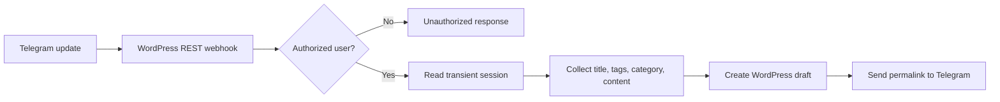

# Architecture

The plugin exposes one public REST route for Telegram webhook updates. Authorization happens inside the handler before session state or content creation is processed.

## Runtime pieces

- `telegram-post-bot.php` registers `telegram/v1/webhook/`.
- Composer loads the Telegram Bot SDK and dotenv library.
- `TELEGRAM_AUTHORIZED_USERS` is parsed into numeric user IDs.
- Session data is stored in a WordPress transient named for the user ID and expires after one hour.
- `wp_insert_post()` creates a `draft` post after the user sends `publish`.

## Security boundary

The webhook route is publicly reachable so Telegram can call it. The current implementation authorizes users inside the handler by comparing the Telegram user ID with `TELEGRAM_AUTHORIZED_USERS`; it does not yet verify a Telegram secret token or cryptographic request signature. Use HTTPS, keep the bot token outside source control, and treat this project as a demonstration until request validation and rate limiting are strengthened. The [companion article](https://omidakhavan.blog/front-end-wordpress-submission-telegram-bot/) documents the same limitation and suggests request-validation and permission improvements.
